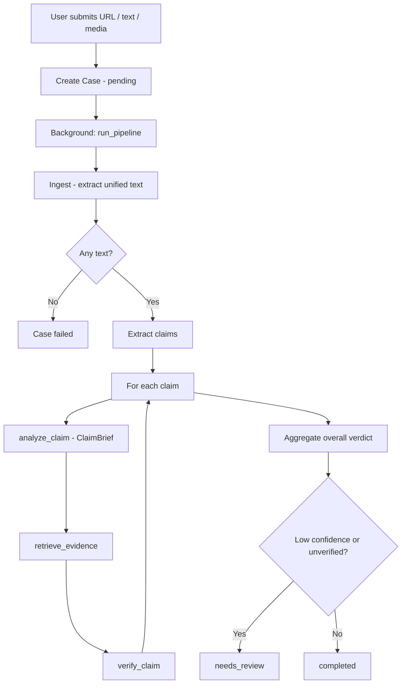

# Sach Khoj (ਸੱਚ ਖੋਜ)

**Evidence-grounded validation for claims about Sikhism and Gurbani.**

Sach Khoj is a research tool that takes social media posts, articles, captions, videos, or screenshots, extracts checkable factual claims, retrieves authoritative passages from Gurbani APIs and a curated corpus, and returns structured verdicts with citations. It is designed to work intelligently on **any claim or topic** — not via hand-maintained keyword lists for each subject.

> **Disclaimer:** This is an AI-assisted research tool, **not** Panthic authority. Outputs are claim assessments for researchers and Sangat review — not personal accusations. Consult a Giani or trusted scholars for religious guidance.

---

## Table of contents

1. [What Sach Khoj does](#what-sach-khoj-does)
2. [High-level architecture](#high-level-architecture)
3. [End-to-end flow](#end-to-end-flow)
4. [Pipeline stages (detailed)](#pipeline-stages-detailed)
5. [General intelligence design](#general-intelligence-design)
6. [Media understanding](#media-understanding)
7. [Knowledge base and curated data](#knowledge-base-and-curated-data)
8. [Gurbani retrieval (BaniDB & GurbaniNow)](#gurbani-retrieval-banidb--gurbaninow)
9. [Verdicts, confidence, and aggregation](#verdicts-confidence-and-aggregation)
10. [Human review queue](#human-review-queue)
11. [Frontend](#frontend)
12. [API reference](#api-reference)
13. [Configuration](#configuration)
14. [Running locally](#running-locally)
15. [Docker Compose](#docker-compose)
16. [Testing and evaluation](#testing-and-evaluation)
17. [Project layout](#project-layout)
18. [Limitations and operational notes](#limitations-and-operational-notes)
19. [Ethical notes](#ethical-notes)

---

## What Sach Khoj does

### Inputs

You can submit any combination of:

| Input | Example | What happens |
|-------|---------|--------------|
| **Social media URL** | Instagram reel, TikTok, YouTube Short, Facebook post, X/Twitter video | Downloads media (when allowed), transcribes speech, reads on-screen text, pulls caption/title |
| **Plain text / caption** | Pasted claim or article excerpt | Used directly |
| **Website article URL** | News/blog link | Fetches and extracts main article text (trafilatura) |
| **Uploaded video or image** | Screen recording of a blocked reel, screenshot | Transcribes audio + vision-reads frames/text |

### Outputs

For each submission, Sach Khoj produces a **case report** containing:

- **Extracted text** — everything the pipeline could read from the submission
- **Per-claim verdicts** — one assessment per atomic factual claim
- **Evidence citations** — BaniDB/GurbaniNow Ang references, curated Rehat/history notes, known-false patterns
- **Overall verdict** — aggregated signal across all claims
- **Pipeline log** — structured debug trail of each stage

### Verdict types

| Verdict | Meaning |
|---------|---------|
| `false` | The claim as written is inaccurate or fabricated |
| `misleading` | Contains a kernel of truth but is framed incorrectly or overstated |
| `unverified` | Not enough on-topic evidence to decide confidently |
| `true` | Consistent with retrieved authoritative sources |
| `not_checkable` | No checkable factual claims could be extracted |

---

## High-level architecture

```
┌─────────────────────────────────────────────────────────────────────────────┐
│                              Next.js Frontend                               │
│  Submit page (URL / text / upload)  →  Case report page (polls until done)  │
└───────────────────────────────────┬─────────────────────────────────────────┘
                                    │ REST API
┌───────────────────────────────────▼─────────────────────────────────────────┐
│                           FastAPI Backend                                   │
│  POST /api/submit  →  background task: run_pipeline(case_id)               │
│                                                                             │
│  ┌──────────┐   ┌──────────┐   ┌───────────┐   ┌──────────┐              │
│  │  Ingest  │ → │  Claims  │ → │ Retrieve  │ → │  Verify  │              │
│  └──────────┘   └──────────┘   └───────────┘   └──────────┘              │
│       │              │               │               │                      │
│       ▼              ▼               ▼               ▼                      │
│  social_media   OpenAI/heuristic  BaniDB/GurbaniNow  OpenAI/heuristic      │
│  media_understand              semantic_index       stance check           │
│  web_fetch                     knowledge_base                              │
│  OCR                                                                        │
└───────────────────────────────────┬─────────────────────────────────────────┘
                                    │
                    ┌───────────────┼───────────────┐
                    ▼               ▼               ▼
              SQLite/Postgres   data/curated/   External APIs
              (cases, claims)   JSON corpus     BaniDB, GurbaniNow, OpenAI
```

### Tech stack

| Layer | Technology |
|-------|------------|
| Backend | Python 3.12, FastAPI, SQLAlchemy (async), httpx |
| Frontend | Next.js (App Router), TypeScript |
| Database | SQLite (local dev) or PostgreSQL (Docker Compose) |
| LLM | OpenAI-compatible API (`gpt-4o-mini` default; Whisper + vision when needed) |
| Media | ffmpeg, ffprobe, yt-dlp, Pillow, pytesseract |
| Search | TF-IDF + synonym expansion (offline); OpenAI embeddings (semantic index) |

---

## End-to-end flow

When a user submits content via `POST /api/submit`:

1. A **Case** row is created with status `pending` and the raw inputs (URL, text, optional uploaded file path).
2. A **background task** starts `run_pipeline(case_id)`.
3. Status moves to `processing` while the four pipeline stages run.
4. Each extracted claim gets its own **Claim** row with verdict, confidence, summary, correction, evidence JSON, and full retrieved passages.
5. An **overall verdict** is computed from per-claim results.
6. If confidence is low or any claim is `unverified`, status becomes `needs_review`; otherwise `completed`.
7. The frontend polls `GET /api/cases/{id}` every 1.5s until processing finishes.



---

## Pipeline stages (detailed)

All orchestration lives in `backend/app/pipeline/__init__.py` (`run_pipeline` → `_process`).

### Stage 1 — Ingest (`backend/app/pipeline/ingest.py`)

**Purpose:** Turn whatever the user provided into a single normalized text blob the claim extractor can read.

**Input sources (combined, deduplicated):**

- User-pasted text
- URL content (article fetch or social media)
- Uploaded media file

**Social media URLs** (`backend/app/integrations/social_media.py`):

Recognized hosts: Instagram, Facebook, TikTok, YouTube, X/Twitter.

Download strategy (in order):

1. **yt-dlp** — primary downloader; optional `SOCIAL_COOKIES_FILE` for logged-in session cookies (Netscape format)
2. **Open Graph fallback** — fetches page HTML as a link-preview bot, extracts `og:video` or `og:image`, downloads directly
3. **Graceful failure** — returns caption/title if available plus a user-facing message to upload the file instead

Every downloaded file is **validated** before use:

- Videos: `ffprobe` must report duration > 0 (rejects HTML error pages saved as `.mp4`)
- Images: PIL `verify()` (rejects corrupt files)

**Media understanding** (see [Media understanding](#media-understanding)) produces labeled sections:

```
[Post title] …
[Post caption] …
[Spoken transcript] …
[On-screen visuals and text] …
[Image content] …
```

**Website URLs** (`backend/app/integrations/web_fetch.py`):

Uses trafilatura to extract article main text and metadata.

**Direct uploads:**

Same media understanding path as downloaded social media.

**Output:**

```python
{
    "extracted_text": str,      # combined normalized text
    "page_title": str | None,
    "page_metadata": dict,
    "blocked": bool,            # True only if NO usable text at all
    "message": str | None,      # e.g. platform blocked download
    "log": list[dict],          # structured ingest events
}
```

If `extracted_text` is empty after ingest, the case fails with a helpful error message.

---

### Stage 2 — Claims (`backend/app/pipeline/claims.py`)

**Purpose:** Split the ingested text into **atomic, checkable factual claims**.

**With OpenAI key (primary path):**

- LLM receives the full text (up to 8000 chars) plus `CLAIM_SCHEMA_HINT` from `backend/app/services/llm.py`
- Returns JSON array of claims with:
  - `text` — the claim statement
  - `category` — one of the categories below
  - `quoted_gurbani` — optional Gurmukhi/romanized snippet if the post quotes scripture

**Special LLM rules:**

- Labeled video sections (`[Spoken transcript]`, `[On-screen visuals and text]`, etc.) are treated like written claims
- Questions ("Does Sikhi allow X?") are converted to factual claims ("Sikhi allows X")
- Mixed posts are split into separate verifiable claims (max ~12)

**Without OpenAI key (heuristic fallback):**

- Sentence-level splitting
- Keeps chunks that match checkable patterns (Gurmukhi blocks, Ang references, Guru names, Rehat keywords, doctrine terms, history markers)
- Infers category from regex rules

**Claim categories:**

| Category | When used |
|----------|-----------|
| `gurbani_misquote` | Fabricated or wrong Gurbani quotation |
| `out_of_context` | Real verse used with misleading framing |
| `historical` | Claims about Gurus, dates, events |
| `rehat` | Khalsa discipline, Maryada, Five Ks |
| `doctrine` | Teachings on Naam, mukti, rituals, diet, formless God, etc. |
| `propaganda` | "Sikhs are a Hindu sect", terrorism tropes, etc. |
| `other` | Everything else |

---

### Stage 3 — Retrieve (`backend/app/pipeline/retrieve.py`)

**Purpose:** Gather **grounded evidence only** — never invent citations.

For **each claim**, retrieval runs in this order:

#### 3a. Understand the claim — `analyze_claim()` (`backend/app/pipeline/relevance.py`)

Before searching anything, the pipeline builds a **ClaimBrief**:

```python
ClaimBrief(
    subject="…",           # real topic in 4–10 words
    about=[…],             # what relevant sources would discuss
    not_about=[…],         # false-friend themes to avoid
    search_terms=[…],      # synonyms (e.g. alcohol → wine, intoxicants)
    gurbani_relevant=True, # False for modern politics, census stats, etc.
    llm_queries=[…],       # 1–3 word BaniDB search terms
    focus_tokens={…},      # lexical subject tokens (fallback)
)
```

This is the **general intelligence layer** — it works for any topic without adding per-subject code paths.

#### 3b. Curated corpus + known-false index

**Semantic search (primary, when embeddings available):**

`backend/app/services/semantic_index.py` embeds every curated passage and known-false pattern once (cached in `backend/.cache/semantic_index.json`), then retrieves by cosine similarity to `brief.expanded_query(claim_text)`.

**Lexical TF-IDF fallback (no API key):**

`backend/app/services/knowledge_base.py` uses TF-IDF + synonym expansion + fuzzy matching over the same corpus.

Known-false matches use **subject overlap** with boilerplate filtering — shared words like "Sikh", "Guru", "Rehat Maryada" alone are not enough to match.

#### 3c. Gurbani search (BaniDB + GurbaniNow)

**Skipped entirely** when `brief.gurbani_relevant is False` (e.g. "British created Khalsa in 19th century" → history, not scripture).

Otherwise, `scripture_queries_for_claim()` (`backend/app/pipeline/gurbani_topics.py`):

1. Runs heuristic topic queries (short 1–3 word searches, never full sentences)
2. Merges LLM-proposed queries from the ClaimBrief
3. Merges model `search_terms` (synonyms for any novel topic)
4. For explicitly quoted Gurmukhi or named Ang numbers: direct fuzzy search / Ang lookup

**Critical rule:** BaniDB is searched using **subject terms**, never filler words from the claim ("completely", "forbids", "Lord", "saved", "fulfilled").

Verses go through a lexical prefilter (`passage_matches_claim`) then the general judge (below).

#### 3d. Evidence judge — `judge_evidence_for_claim()`

**One general gate** for ALL candidate evidence (curated notes, known-false rows, Gurbani verses):

- LLM reads the ClaimBrief + claim + candidate list
- Returns `keep_ids` for items a careful researcher would actually cite
- Drops filler-word matches, wrong-sense polysemy (e.g. "flesh" = body vs food), and cross-topic collisions (meat note ≠ alcohol claim)

Items explicitly quoted by the user (`named_ang`, `quoted_scripture`) bypass the judge.

**Final ranking:**

1. Known False Claims Index (highest priority)
2. BaniDB / GurbaniNow scripture
3. Curated corpus notes

Returns up to **10 evidence items** per claim.

---

### Stage 4 — Verify (`backend/app/pipeline/verify.py`)

**Purpose:** Produce a structured verdict grounded **only** in retrieved evidence.

**With OpenAI (primary):**

1. Filter to on-topic evidence (`_on_topic_evidence`)
2. If none → `unverified` at low confidence
3. LLM receives claim, ClaimBrief, compact evidence list, and `VERDICT_SCHEMA_HINT`
4. Must cite evidence by `id` only — no invented Ang numbers or verses
5. **Stance consistency check** (`_consistency_check`) — asks whether the summary supports or refutes the claim (fixes "summary says false but verdict=true")
6. **Writeup alignment** (`_align_verdict_with_writeup`) — regex fallback if summary explicitly refutes claim
7. **Gurbani weaving** (`_ensure_gurbani_in_explanation`) — if summary is thin, appends on-topic verse quotes with Ang references

**Without OpenAI (heuristic fallback):**

- Known-false match → `false` with index explanation
- Quoted Gurbani fuzzy match ≥ 88% → `true` or `misleading` (out of context)
- Quoted Gurbani fuzzy match < 55% → `false` (misquote)
- Otherwise → `unverified` with retrieved passages attached

**Hard rules (both paths):**

- `false` / `misleading` / `true` without any cited evidence → downgraded to `unverified`
- Off-topic Gurbani (matched only on filler words) must never appear in citations

---

## General intelligence design

Sach Khoj deliberately avoids maintaining topic-specific keyword patches (meat, alcohol, caste, etc.). Instead, two general mechanisms scale to **any claim**:

### 1. ClaimBrief (`analyze_claim`)

The LLM reads the claim once and outputs structured understanding:

- **subject** — the real issue, not rhetoric
- **about / not_about** — what evidence would and would not be relevant
- **search_terms** — synonyms and related concepts for retrieval
- **gurbani_relevant** — whether scripture search makes sense
- **queries** — short BaniDB search strings likely to hit real verses

Example: "Sikhi completely forbids alcohol" → subject: alcohol/intoxicants in Sikh teaching; search_terms: wine, liquor, intoxicants; not_about: generic lines about the Lord saving someone.

### 2. General evidence judge (`judge_evidence_for_claim`)

One LLM call gates **every** candidate — curated Rehat notes, known-false patterns, and Gurbani verses — against the ClaimBrief. This prevents:

- Filler-word Gurbani hits ("completely fulfilled" matching a meat claim)
- Cross-topic corpus collisions (education note matching a meat claim)
- Polysemy false friends ("flesh" meaning body vs food)

### Lexical fallback (no API key)

When `OPENAI_API_KEY` is unset or set to `test-disabled`, the system degrades gracefully:

| Component | Fallback |
|-----------|----------|
| ClaimBrief | `_heuristic_brief()` — token extraction minus filler sets |
| Corpus search | TF-IDF + synonym groups in `knowledge_base.py` |
| Evidence judge | `passage_matches_claim()` + `POLYSEMY_CONTEXT` rules |
| Verdict | Fuzzy Gurbani matching + known-false index |

The filler token lists (`FILLER_QUERY_TOKENS`, `FOCUS_DROP`, `BOILERPLATE_TOKENS`) in `relevance.py` exist **only** for this degraded mode — they are not the primary intelligence path.

### Semantic index

`SemanticIndex` embeds the full curated corpus + known-false index using `text-embedding-3-small`. Vectors are cached on disk so restarts do not re-embed unchanged data. When embeddings are unavailable, retrieval falls back to lexical search automatically (`search()` returns `None` → caller uses TF-IDF).

---

## Media understanding

Implemented in `backend/app/services/media_understanding.py` and wired through ingest.

### Video pipeline

```
Video file
    ├── transcribe_media()     Whisper API (whisper-1)
    │       └── ffmpeg extracts mono 16kHz MP3 (max MAX_VIDEO_SECONDS)
    └── describe_video_frames()
            └── ffmpeg samples N frames evenly across duration
                └── Vision model reads on-screen text + describes visuals
```

Default: **6 frames** sampled (`VIDEO_FRAMES_TO_SAMPLE`). Requires `ffmpeg` and `ffprobe`.

### Image pipeline

```
Image file
    ├── understand_image()     Vision model: exact text + description
    └── ocr_image()            pytesseract fallback when vision unavailable
```

### Labeled output sections

These labels tell the claim extractor where each assertion came from:

| Section | Source |
|---------|--------|
| `[Post title]` | yt-dlp / Open Graph metadata |
| `[Post caption]` | Post description |
| `[Spoken transcript]` | Whisper transcription |
| `[On-screen visuals and text]` | Vision model on video frames |
| `[Image content]` | Vision model on uploaded/downloaded image |

### Social media download limits

| Setting | Default | Purpose |
|---------|---------|---------|
| `MAX_UPLOAD_BYTES` | 200 MB | Direct user uploads |
| `MAX_MEDIA_DOWNLOAD_BYTES` | 300 MB | yt-dlp / OG downloads |
| `MAX_VIDEO_SECONDS` | 900 (15 min) | Transcription and frame sampling cap |

### Platform reliability

Datacenter IPs are often blocked by Instagram/Facebook/YouTube. Two mitigations:

1. **`SOCIAL_COOKIES_FILE`** — Netscape-format cookies exported from a logged-in browser ([yt-dlp FAQ](https://github.com/yt-dlp/yt-dlp#exporting-youtube-cookies))
2. **Upload fallback** — save/screen-record the post and upload; analysis is identical

---

## Knowledge base and curated data

Curated JSON files live in `data/curated/`:

| File | Contents |
|------|----------|
| `rehat_maryada.json` | Rehat Maryada clauses, Khalsa discipline, identity |
| `sikh_theology.json` | Doctrine: Naam, mukti, formless God, rituals |
| `sikh_history.json` | Historical facts: Gurus, Khalsa, SGGS |
| `gurbani_notes.json` | Interpretive notes on common misquotes |
| `known_false_claims.json` | Seed index of common misinformation patterns (`kf-001` … `kf-028`) |

Each corpus file uses this shape:

```json
{
  "source": "Rehat Maryada",
  "chunks": [
    {
      "id": "rehat:langar",
      "reference": "Langar equality",
      "excerpt": "…",
      "tags": ["langar", "equality"],
      "keywords": ["caste", "kitchen"],
      "category": "rehat"
    }
  ]
}
```

`known_false_claims.json` uses:

```json
{
  "claims": [
    {
      "id": "kf-001",
      "claim_pattern": "The British created the Khalsa…",
      "category": "historical",
      "explanation": "…",
      "correction": "…",
      "source_refs": ["hist:khalsa"],
      "aliases": ["optional alternate phrasings"]
    }
  ]
}
```

At startup, `get_knowledge_base().load()` reads all files, builds a TF-IDF matrix, and seeds the semantic index. Admin-added known-false entries via the review API are appended to the in-memory index immediately.

---

## Gurbani retrieval (BaniDB & GurbaniNow)

### BaniDB (`backend/app/integrations/banidb.py`)

- Base URL: `https://api.banidb.com/v2` (configurable via `BANIDB_BASE_URL`)
- Search types: `2` = Gurmukhi word, `3` = English translation
- Ang lookup: direct fetch for Angs 1–1430
- Fuzzy search for quoted Gurmukhi snippets
- In-memory response cache per process

### GurbaniNow (`backend/app/integrations/gurbaninow.py`)

- Base URL: `https://api.gurbaninow.com/v2` (configurable via `GURBANINOW_BASE_URL`)
- Used as secondary source when BaniDB returns insufficient results

### Quote relevance rules

The pipeline enforces strict relevance at multiple layers:

1. **Search query gate** — never search BaniDB with filler words or full English sentences
2. **Lexical prefilter** — `passage_matches_claim()` requires distinctive subject overlap
3. **Polysemy guard** — `POLYSEMY_CONTEXT` disambiguates "flesh", "form", "amrit"
4. **General judge** — LLM keep/drop on all candidates
5. **Verifier prompt** — explicit instruction to ignore off-topic verses
6. **On-topic filter** — post-verification drop of ungated off-topic rows
7. **Gurbani weaving guard** — only quotes verses that pass `verse_matches_claim()`

This multi-layer approach prevents the classic failure mode: returning Ang 133 because BaniDB matched the word "completely".

---

## Verdicts, confidence, and aggregation

### Per-claim fields

| Field | Description |
|-------|-------------|
| `verdict` | One of the five verdict types |
| `confidence` | 0.0–1.0 float |
| `summary` | 4–8 sentence teaching-style explanation (LLM path) |
| `correction` | Accurate information when claim is false/misleading |
| `evidence` | Cited evidence items (id, source, reference, excerpt, translation) |
| `retrieved_passages` | Full retrieval set (includes items not cited in summary) |

### Overall case aggregation (`_aggregate` in pipeline)

- Picks the **strongest negative signal** (`false` > `misleading` > `unverified` > …)
- Averages confidence across claims
- Builds a human-readable overall summary

### Review threshold

`CONFIDENCE_REVIEW_THRESHOLD` defaults to **0.7**. Cases go to `needs_review` when:

- No claims extracted
- Overall confidence < threshold
- Overall verdict is `unverified` or `not_checkable`
- Any individual claim is `unverified` or below threshold

---

## Human review queue

Admin endpoints under `/api/review/*` require:

```
Authorization: Bearer <ADMIN_TOKEN>
```

| Action | Effect |
|--------|--------|
| `approve` | Mark review approved; case → `completed` |
| `dismiss` | Dismiss review concern; case → `completed` |
| `override` | Set custom overall verdict and/or per-claim overrides |

Reviewers can also add new **known-false patterns** via `POST /api/review/known-false`. These persist to the database and are immediately available in retrieval.

---

## Frontend

Next.js app in `frontend/`:

| Route | Purpose |
|-------|---------|
| `/` | Landing page |
| `/submit` | Submission form (URL, text, language hint, file upload) |
| `/cases/[id]` | Case report with live polling during processing |

The case page shows a three-step progress indicator (Ingest → Retrieve → Verify) while status is `pending` or `processing`, then renders `VerdictCard` components per claim with evidence citations. Extracted text and pipeline log are available in collapsible sections.

API base URL: `NEXT_PUBLIC_API_URL` (default `http://localhost:8000`).

---

## API reference

### Public

| Method | Path | Description |
|--------|------|-------------|
| `GET` | `/api/health` | `{ status, llm_enabled, app }` |
| `POST` | `/api/submit` | Create case (multipart form) |
| `GET` | `/api/cases` | List cases (`?limit`, `?offset`, `?status`) |
| `GET` | `/api/cases/{id}` | Full case report with claims |

#### `POST /api/submit`

**Content-Type:** `multipart/form-data`

| Field | Type | Required | Description |
|-------|------|----------|-------------|
| `url` | string | one of three | Article or social media URL |
| `text` | string | one of three | Caption or claim text |
| `media` | file | one of three | Video or image upload |
| `language_hint` | string | no | `auto` (default), `gurmukhi`, `english` |

Returns the created `CaseOut` immediately (processing runs in background).

### Admin (requires Bearer token)

| Method | Path | Description |
|--------|------|-------------|
| `GET` | `/api/review/queue` | Cases needing review |
| `POST` | `/api/review/{case_id}` | `{ action, notes?, overall_verdict?, claim_overrides? }` |
| `GET` | `/api/review/known-false` | List DB known-false entries |
| `POST` | `/api/review/known-false` | Add known-false pattern |

Interactive docs: `http://localhost:8000/docs` when the backend is running.

---

## Configuration

All settings are in `backend/app/config.py` (Pydantic Settings, reads `backend/.env` and process env).

| Variable | Default | Description |
|----------|---------|-------------|
| `OPENAI_API_KEY` | *(empty)* | Enables LLM claims, verify, judge, embeddings, Whisper, vision |
| `OPENAI_MODEL` | `gpt-4o-mini` | Chat model for claims/verify/judge |
| `OPENAI_EMBED_MODEL` | `text-embedding-3-small` | Semantic index embeddings |
| `OPENAI_VISION_MODEL` | *(empty → uses OPENAI_MODEL)* | Frame/image understanding |
| `OPENAI_TRANSCRIBE_MODEL` | `whisper-1` | Audio transcription |
| `OPENAI_BASE_URL` | `https://api.openai.com/v1` | OpenAI-compatible API base |
| `DATABASE_URL` | `sqlite+aiosqlite:///./sachkhoj.db` | Async SQLAlchemy URL |
| `CURATED_DATA_DIR` | `../data/curated` | Path to curated JSON corpus |
| `UPLOAD_DIR` | `./uploads` | Stored uploads and social downloads |
| `ADMIN_TOKEN` | `dev-admin-token` | Bearer token for review endpoints |
| `CORS_ORIGINS` | `http://localhost:3000,…` | Comma-separated allowed origins |
| `CONFIDENCE_REVIEW_THRESHOLD` | `0.7` | Below this → human review |
| `MAX_UPLOAD_BYTES` | 209715200 (200 MB) | Max direct upload size |
| `MAX_MEDIA_DOWNLOAD_BYTES` | 314572800 (300 MB) | Max social download size |
| `MAX_VIDEO_SECONDS` | `900` | Max video length for transcription |
| `VIDEO_FRAMES_TO_SAMPLE` | `6` | Frames sent to vision model |
| `SOCIAL_COOKIES_FILE` | *(empty)* | Netscape cookies for yt-dlp |
| `BANIDB_BASE_URL` | `https://api.banidb.com/v2` | BaniDB API |
| `GURBANINOW_BASE_URL` | `https://api.gurbaninow.com/v2` | GurbaniNow API |

**Important:** If your shell has `OPENAI_API_KEY=test-disabled` (common in CI), it overrides `.env`. Unset it before sourcing:

```bash
unset OPENAI_API_KEY && set -a && source .env && set +a
```

Values that disable the LLM: empty, `test-disabled`, `none`, `disabled`.

---

## Running locally

### Prerequisites

- Python 3.12+
- Node.js 18+
- **ffmpeg** and **ffprobe** (`apt install ffmpeg` on Debian/Ubuntu)
- Optional: **tesseract** for OCR fallback (`apt install tesseract-ocr`)

### Backend

```bash
cd backend
python -m venv .venv
source .venv/bin/activate
pip install -r requirements.txt

export DATABASE_URL=sqlite+aiosqlite:///./sachkhoj.db
export CURATED_DATA_DIR=../data/curated
export UPLOAD_DIR=./uploads
export ADMIN_TOKEN=dev-admin-token
# export OPENAI_API_KEY=sk-...   # strongly recommended for full pipeline

uvicorn app.main:app --reload --host 0.0.0.0 --port 8000
```

### Frontend

```bash
cd frontend
npm install
export NEXT_PUBLIC_API_URL=http://localhost:8000
npm run dev
```

Open **http://localhost:3000**

---

## Docker Compose

```bash
cp .env.example .env   # add OPENAI_API_KEY
docker compose up --build
```

| Service | URL |
|---------|-----|
| Frontend | http://localhost:3000 |
| Backend API | http://localhost:8000 |
| API docs | http://localhost:8000/docs |

Compose runs PostgreSQL, Redis (reserved for future use), backend, and frontend. Curated data is mounted from `./data`; uploads persist in a Docker volume.

---

## Testing and evaluation

### Offline unit tests (no OpenAI required)

```bash
cd backend
OPENAI_API_KEY=test-disabled pytest -q
```

Tests cover pipeline components, relevance gates, ingest, and API smoke checks.

### Live evaluation harness

Runs the **real** retrieve + verify pipeline against BaniDB and OpenAI, scoring both verdict accuracy and **quote discipline** (no filler-word Gurbani citations):

```bash
cd backend
unset OPENAI_API_KEY && set -a && source .env && set +a
python scripts/eval_live.py
```

Options:

```bash
python scripts/eval_live.py --ids d-meat-ban,h-british-khalsa   # specific fixtures
python scripts/eval_live.py --http-smoke                         # include API health check
```

- Fixtures: `data/golden/live_eval.json` (32 scenarios across doctrine, history, propaganda, Gurbani misquotes, true controls)
- Results: `backend/.eval/last_run.json`

Each fixture specifies:

- `expected_verdict` — acceptable verdict labels
- `must_match` — subject terms that should appear in evidence/summary
- `must_not_quote` — filler phrases that must never be cited as Gurbani
- `forbidden_evidence` — off-topic corpus hits that must not appear

---

## Project layout

```
.
├── README.md
├── docker-compose.yml
├── .env.example
│
├── backend/
│   ├── app/
│   │   ├── main.py                 # FastAPI app, lifespan, CORS
│   │   ├── config.py               # Settings / env vars
│   │   ├── database.py             # Async SQLAlchemy engine
│   │   ├── schemas.py              # Pydantic request/response models
│   │   ├── models/                 # Case, Claim, KnownFalseClaim ORM
│   │   ├── routers/
│   │   │   ├── submit.py           # POST /api/submit
│   │   │   ├── cases.py            # GET /api/cases*
│   │   │   └── review.py           # Admin review queue
│   │   ├── pipeline/
│   │   │   ├── __init__.py         # run_pipeline orchestrator
│   │   │   ├── ingest.py           # Stage 1: text extraction
│   │   │   ├── claims.py           # Stage 2: claim extraction
│   │   │   ├── retrieve.py         # Stage 3: evidence retrieval
│   │   │   ├── verify.py           # Stage 4: verdict generation
│   │   │   ├── relevance.py        # ClaimBrief, judge, lexical gates
│   │   │   └── gurbani_topics.py   # BaniDB query planning
│   │   ├── integrations/
│   │   │   ├── banidb.py           # BaniDB API client
│   │   │   ├── gurbaninow.py       # GurbaniNow API client
│   │   │   ├── social_media.py     # yt-dlp + OG download
│   │   │   ├── web_fetch.py        # Article extraction
│   │   │   └── ocr.py              # pytesseract wrapper
│   │   └── services/
│   │       ├── llm.py              # OpenAI chat + embeddings
│   │       ├── knowledge_base.py   # Curated corpus TF-IDF
│   │       ├── semantic_index.py   # Embedding-based retrieval
│   │       ├── media_understanding.py  # Whisper + vision
│   │       └── seed.py             # DB seed for known-false
│   ├── scripts/
│   │   └── eval_live.py            # Live evaluation harness
│   ├── tests/
│   │   └── test_pipeline.py
│   ├── requirements.txt
│   └── Dockerfile
│
├── frontend/
│   ├── app/
│   │   ├── page.tsx                # Landing
│   │   ├── submit/page.tsx         # Submission form
│   │   └── cases/[id]/page.tsx     # Case report (polls)
│   ├── components/
│   │   └── VerdictCard.tsx
│   └── lib/api.ts                  # API client
│
└── data/
    ├── curated/                    # Rehat, history, theology, known-false JSON
    └── golden/
        └── live_eval.json          # Live eval fixtures + rubric
```

---

## Limitations and operational notes

| Limitation | Detail |
|------------|--------|
| **Not Panthic authority** | AI synthesis can err; human review exists for low-confidence cases |
| **Social platform blocking** | Instagram/Facebook often block datacenter IPs; use cookies or upload fallback |
| **LLM required for best results** | Without `OPENAI_API_KEY`, claims/verify/judge/embeddings/Whisper/vision degrade to heuristics |
| **Video length cap** | 15-minute max by default (`MAX_VIDEO_SECONDS`) |
| **Case immutability** | Re-running the pipeline requires resubmitting; old cases reflect the code version at processing time |
| **In-memory API caches** | BaniDB responses cached per backend process; restart clears cache |
| **Semantic index cache** | Stored at `backend/.cache/semantic_index.json`; delete to force re-embed after corpus edits |
| **SQLite vs Postgres** | Local dev uses SQLite; Docker uses Postgres — same schema, different URL |
| **Redis in Compose** | Provisioned but not yet used by application code |

### Production recommendations

1. Set a strong `ADMIN_TOKEN`
2. Provide `SOCIAL_COOKIES_FILE` for reliable reel/post downloads
3. Use PostgreSQL with persistent volumes
4. Expand `data/golden/live_eval.json` with scholar-reviewed fixtures before treating output as production-grade
5. Route low-confidence cases through the human review queue

---

## Ethical notes

- **Prefer user-submitted content** over automated social scraping at scale
- **Frame outputs as claim assessments**, not accusations against individuals
- **Cite sources transparently** — every verdict should trace to retrieved evidence IDs
- **Expand the golden evaluation set** with Giani, historians, and gurdwara media teams
- **Respect platform terms** — downloads only fetch publicly served content; no authentication bypass

---

## Quick reference

```bash
# Backend (local)
cd backend && source .venv/bin/activate
uvicorn app.main:app --reload --port 8000

# Frontend (local)
cd frontend && NEXT_PUBLIC_API_URL=http://localhost:8000 npm run dev

# Tests
cd backend && OPENAI_API_KEY=test-disabled pytest -q

# Live eval
cd backend && unset OPENAI_API_KEY && set -a && source .env && set +a
python scripts/eval_live.py

# Docker
docker compose up --build
```
